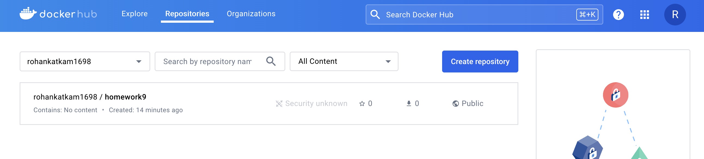
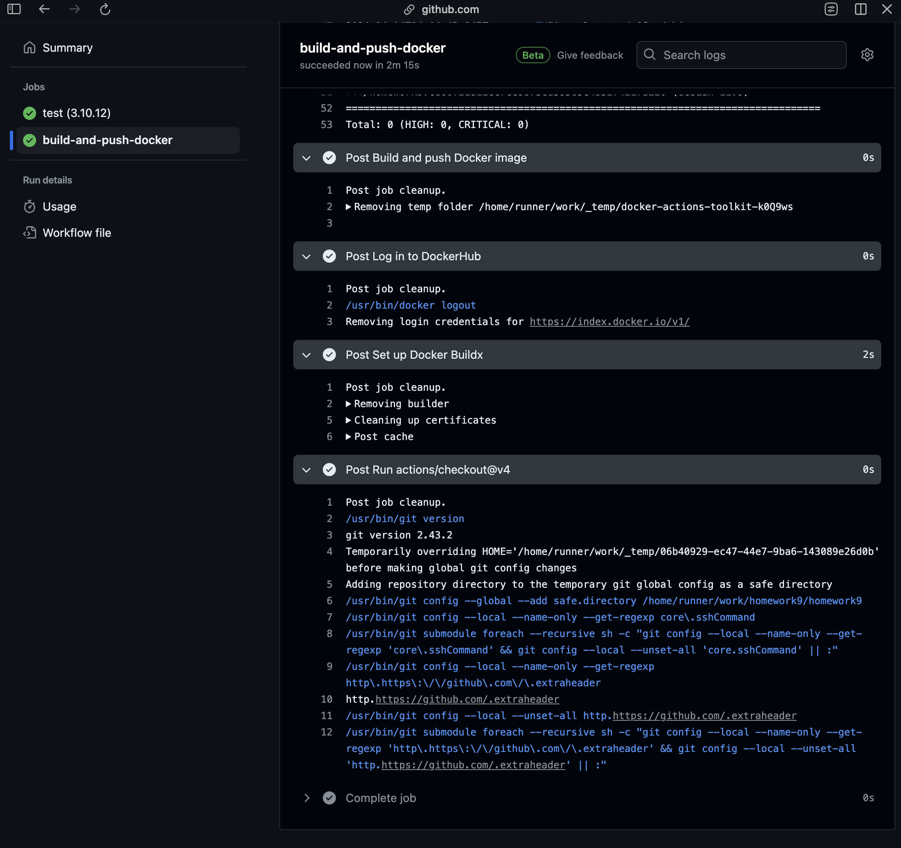

# app/routers/oauth.py
1. token typo error

 # test/start_test.py
 1. Added <b> try-catch <b> block for error handling
 2. Changed base_url from <b> test <b> to <b> testserver <b>
 3. The import statement for the FastAPI application (from app.main import app), assuming that app is the name of your FastAPI application instance.
 4. The test should now correctly send a request to http://testserver/token and assert that the response status code is 200.

 # app/routers/qr_code.py
 1. typo error, changed from @router.post("/qr-coes/") to @router.post("/qr-codes/")
 2. The status code should be 201 instead of 200
 3. There's a typo in the path parameter name ("{qr_fileame}" should be "{qr_filename}")
 4. Missing import for the QRCodeResponse model.

 # app/config.py
 1. added missing env variables

 # app/main.py
 1. Added prefix="/qr"
 2. Added prefix="/oauth"

 # tests/conftest.py
 1. Added the async with statement to get_access_token_for_test fixture, ensuring that the AsyncClient is properly closed after its usage.
 2. Inside get_access_token_for_test, I've replaced the usage of the client fixture with a new AsyncClient instance (ac)

# This is correct working directory
https://github.com/rk94407/homework9/tree/main

# Docker Hub Image

# Github Action Image

